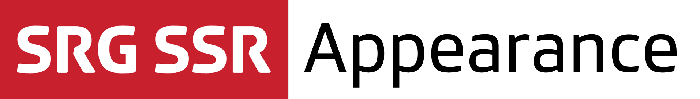

[](https://github.com/Carthage/Carthage) 

## About

SRG Appearance is a lightweight library providing unified SRG SSR appearance to iOS applications:

* Official SRG SSR fonts, automatically registered with your application, and with standard point sizes for common text styles.
* Official SRG SSR colors.

## Compatibility

The library is suitable for applications running on iOS 9 and above. The project is meant to be opened with the latest Xcode version (currently Xcode 8).

## Installation

The library can be added to a project using [Carthage](https://github.com/Carthage/Carthage)  by adding the following dependency to your `Cartfile`:
    
```
github "SRGSSR/srgappearance-ios"
```

Then run `carthage update` to update the dependencies. You will need to manually add the `SRGAppearance.framework` generated in the `Carthage/Build/iOS` folder to your project.

For more information about Carthage and its use, refer to the [official documentation](https://github.com/Carthage/Carthage).

## Usage

When you want to use classes or functions provided by the library in your code, you must import it from your source files first.

### Usage from Objective-C source files

Import the global header file using:

```objective-c
#import <SRGAppearance/SRGAppearance.h>
```

or directly import the module itself:

```objective-c
@import SRGAppearance;
```

### Usage from Swift source files

Import the module where needed:

```swift
import SRGAppearance
```

## SRG SSR fonts

Two sets of font methods are provided in `UIFont+SRGAppearance.h`:

* Methods returning a font with a given size. You can also set fonts with a given size directly in Interface Builder. Simply install the fonts available in `Carthage/Checkouts/iOS/srgappearance-ios/Framework/Resources/Fonts` by double-clicking on them first.
* Methods returning a font for a given text style. The exact font size is determined by the corresponding iOS accessibility setting. Setting custom fonts for a given style is sadly currently not supported in Interface Builder and must be performed in code.

You can also register your own custom fonts at runtime by calling the `SRGAppearanceRegisterFont` function available from the same header file.

## SRG SSR text styles

A limited set of SRG SSR custom font styles is provided as well. SRG SSR fonts are readily compatible with those styles, and a method is provided to apply them to arbitrary fonts as well.

## SRG SSR colors

Standard colors are provided in `UIColor+SRGAppearance.h`.

## License

See the [LICENSE](LICENSE) file for more information.


