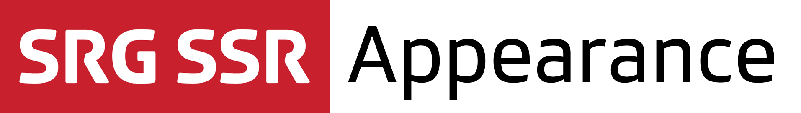

[](https://github.com/SRGSSR/srgappearance-apple)

[](https://github.com/SRGSSR/srgappearance-apple/releases) [](https://github.com/SRGSSR/srgappearance-apple) [](https://swift.org/package-manager) [](https://github.com/SRGSSR/srgappearance-apple/blob/master/LICENSE)

## About

SRG Appearance is a lightweight library providing unified SRG SSR appearance to iOS and tvOS applications:

* Official SRG SSR fonts, automatically registered with your application, and with standard point sizes for common text styles.
* Official SRG SSR colors.
* Image processing tools.

## Compatibility

The library is suitable for applications running on iOS 12, tvOS 12 and above. The project is meant to be compiled with the latest Xcode version.

## Contributing

If you want to contribute to the project, have a look at our [contributing guide](CONTRIBUTING.md).

## Integration

The library must be integrated using [Swift Package Manager](https://swift.org/package-manager) directly [within Xcode](https://developer.apple.com/documentation/xcode/adding_package_dependencies_to_your_app). You can also declare the library as a dependency of another one directly in the associated `Package.swift` manifest.

## Usage

When you want to use classes or functions provided by the library in your code, you must import it from your source files first. In Objective-C:

```objective-c
@import SRGAppearance;
```

or in Swift:

```swift
import SRGAppearanceSwift
```

This requires your target to link against the corresponding Swift package product.

## SRG SSR fonts

Official SRG SSR Fonts are available from the `SRGFont` class. Fonts can be used in two different ways:

- Using standard styles: The library defines a set of semantic styles which have an associated font family, size and weight. These fonts are aligned on text styles to automatically scale according to accessibility settings.
- By manually specifying a family, a size and a weight. The size can be fixed or automatically aligned on a given text style for automatic scaling according to accessibility settings.

The SDK also provides access to standard `UIFontDescriptors` for advanced font customization, as well as `UIFontMetrics` for scaling values according to accessibility text size settings. APIs are available for better integration into SwiftUI code (`Font` methods and `@SRGScaledMetric` for scaling values).

If you do not want to use the standard styles provided by SRG Appearance we recommend your application defines its own set of styles, using `SRGFont` API to provide the family, size, weight and text style associated with each style.

## SRG SSR colors

Standard colors are provided in `UIColor+SRGAppearance.h`.

## Image processing

Image processing tools are provided in `UIImage+SRGAppearance.h`.

## License

See the [LICENSE](../LICENSE) file for more information.


